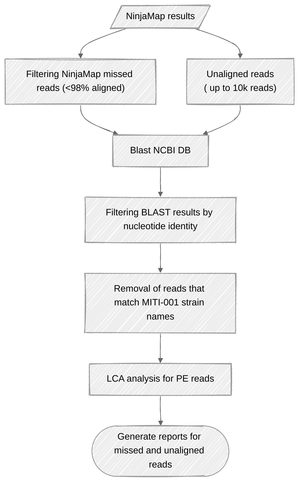

# nf-dsqc Workflow

```mermaid
---
config:
  layout:
  look: handDrawn
  theme: neutral
  
---
flowchart TD
    reads[/NinjaMap results/]-->filter["Filtering NinjaMap missed reads (<98% aligned)"]
    reads[/NinjaMap results/]-->unaligned["Unaligned reads 
    ( up to 10k reads)"]
    filter --> BLAST[Blast NCBI DB]
    unaligned --> BLAST[Blast NCBI DB]
    BLAST --> Bfiltering[Filtering BLAST results by nucleotide identity]
    Bfiltering --> Mfiltering[Removal of reads that match MITI-001 strain names]
    Mfiltering --> LCA[LCA analysis for PE reads]
    LCA --> R([Generate reports for missed and unaligned reads])
```